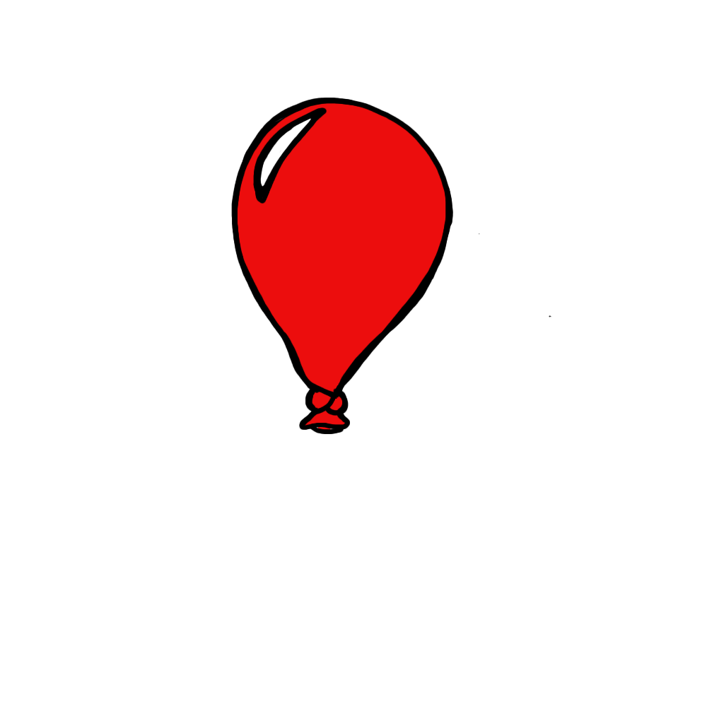
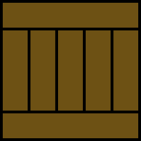
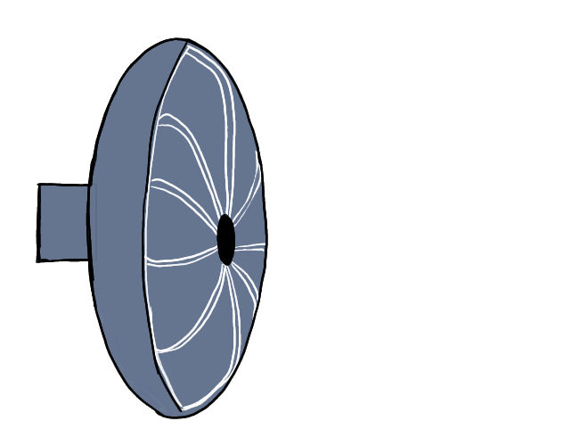
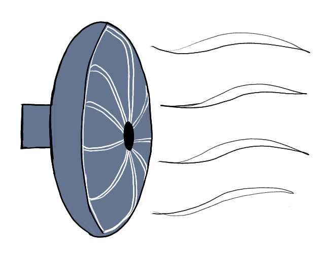
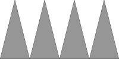

# Balloon Bonanza

Created by Ben Morgan and Riley Mawson

Find the playable version on itch.io: [Balloon Bonanza](https://getouttatown72.itch.io/balloon-bonanza)

This repo contains the entirety of the Assets folder for the Unity Project.

## Overview

The goal of this game is to control the various devices to help the balloon travel to the green goal section of the level. To control the devices, you will write code using preformec code blocks. Once you are satisfied with your code, hit the Run button. The trapdoor will drop, releasing the balloon and your code will begin to execute. If your code was correct, the devices will successfully guide th balloon into the goal.

## Game Components

### Main Game

Balloon Bonanza is designed to very expandable. None of the current levels are hardcoded into the scripts. Levels rely on json config scripts that contain lists of the various assets in the game, i.e. balloon, fans, spikes, crates, and the locations of each of them on the game board. These config scripts (stored at `Assets/StreamingAssets`) are read at level start and the various assets are placed in their specified places. Currently generation of code blocks in dependent on the fans, one fan_timer block is generated per fan placed in the level. If more types of code blocks were created for the game then the config file would likely need to be expanded to contain these as well.

Example Level 2 config file:

```json
{
    "levelId": 1,
    "balloonCoords": {"x": -3.5, "y": 3.3, "z": 0.0},
    "fanCoords": [
        {"x": 0.0, "y": 1.5, "z": 0.0},
        {"x": 2.0, "y": 0.8, "z": 0.0}
    ],
    "spikeCoords":[
        {"x": -3.5, "y": -1.5, "z": 0.0}
    ],
    "crateCoords":[{"x": 1.5, "y": 0.5, "z": 0.0}],
    "goalCoords": {"x": 8.0, "y": -0.76, "z": 0.0}
}
```

### Level Designer

To facilitate creating more levels, there is also a level designer that can be accessed from the Start Menu. This option takes you a screen that looks like the main game but no code blocks are present and all of the game assets are displayed in the lefthand column. These assets, as well as the balloon and goal, can be dragged and placed onto the game board. Once the assets are placed where desired, click **Save Config** and a config file will be generated at `C:\Users\<user>\AppData\LocalLow\DefaultCompany\Balloon Bonanza\customLevel.json`. Clicking **Load Config** will read the config at this same location and place the assets into the designer. This config file can then be copied into the StreamingAssets folder to be used in the main game.

## Assets

### Materials

### Prefabs

#### Balloon prefab:

Used for the balloon that gets blown around the map. Is is instantiated on level start. It contains a Rigidbody 2D component so it is affected by gravity and other effectors in the game. When a balloon object pops it will cycle through a sequence of balloon popping sprites.



#### Crate prefab:

Used to create barriers in the level. It contains a Box Collider 2D and a Rigid Body 2D. Since it is affected by gravity, if you create a level with floating crates they will fall down when the level is loaded. If the balloon collides with a crate it will **not** pop.



#### Fan prefab:

Contains a fan sprite, Box Collider 2D, and Area Effector 2D. It is currently the only programmable asset within the game. It is controlled by the Fan.cs script that toggles its two states, on and off. It defaults to the off state where it sets the effector area magnitude to zero and displays the fan sprite with no blowing lines. The On states sets the effect are magnitude to 1.0f and changes the sprite to show blowing lines.




#### FanControlBlock

This prefab is used to generate a fan_timer code block. It contains a Box Collider 2D to help with the dragging and dropping and is controlled by the FanCtrlBlock.cs script. One of these objects is generated per fan on the board and although it not currently obvious, fan control blocks are tied to a single fan object.

#### Goal prefab:

Contains a Box Collider 2D which, when triggered by a balloon object, will end the level and display the win popup. Also contains an Area Effector 2D to slow down the balloon and keep it in the goal once it arrives.


#### Popup prefabs:

The two prefabs WinPopup and GameoverPopup are displayed when the level is won or lost. 


#### Spikes prefab:

Contains a Box Collider 2D that is used as a trigger within the Balloon.cs script. When a balloon collides with spiked the balloon will pop and the level will need to be restarted.



### Scenes

The game starts on the StartMenu scene which contains a brief description of the game and shows the options for **Start Game**, **Level Designer**, or **Exit**. Selecting **Start Game** with take you you through 7 tutorial scenes before finally taking you to the MainScene which contains the core game. Selecting **Level Designer** with take you to the LevelDesigner scene. Selecting **Exit** closes the game.

StartMenu > tut1 > tut2 > tut3 > tut4 > tut5 > tut6 > tut7 > Main Scene  
StartMenu > LevelDesigner

### Scripts

The core mechanics of the game are all controlled in C# scripts.

#### GameManager.cs

This script controls the game flow of the main game. Its `Start()` function reads the level config file and instantiates all of the appropriate objects onto the game board. It contains all of the high level functions like stopping and starting the level as well as handling gameover and winning events. Once a level ends it will `Destroy()` all of the previously instantiated game objects for that level.

#### DesignManager.cs

This scripts controls the higher level game flow for the Level Designer. It will generate all of the objects. I also saves the current design into a config file and reads config files to allow further modification.

#### CodePanel.cs

This scripts handles creating all of the code block objects at the start of the level. It also handles reading the code blocks once populated and executing the corresponding actions.

### Sprites

All of the raw images for the assets are contained in this folder. These have been tied to prefabs for use within the actual game.

### StreamingAssets

As previously mentioned, this folder contains the json config files for the levels.

## Modifying the Game

Importing this asset folder should give you all you need to create you own version of the game. New levels can be easily created with the existing assets but more components could definitely be added with some work.

New obstacles can be easily added so long as they use the built in Box Collider 2D component. Using the "Obstacle" tag on an object will make it so that the baloon pops when it collides. Using the "CompleteLevel" tag will make it so that the level is won when the balloon collides with that object. Non-tagged objects are currently meant to just get in the way

Adding code blocks would require a fair bit of coding within the CodePanel.cs script. We had wanted to add a block for `if ():` statements but ran out of time. This could have been accomplished with having another CodeBlock object that would monitor states of other objects and determine if it was enabled based on that.

We also wanted to add sensors to the game. A proximity sensor could be created with a Box Collider 2D that is used as a trigger so that the object goes into an enabled state when the balloon collides with that area. This could then be used in an `if ():` condition to enable a fan. We envisioned something along the following lines:

```Python
if (proximity_sensor.enabled):
    fan_timer = 3
```

## References

The biggest reference in developing this game was the [Unity Scripting Reference](https://docs.unity3d.com/ScriptReference/)
